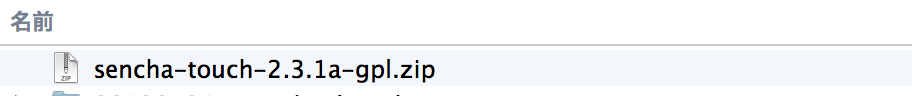
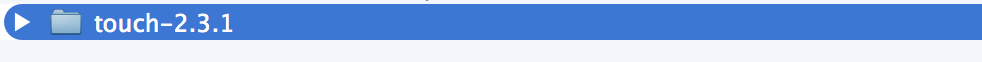

# 事前準備

## 今回のハンズオンに必要なもの

今回のハンズオンで利用する周辺ツールは下記になります。  
このREADMEでは、各インストール手順を解説していきますので当日までに環境構築をお願いします。

- Sencha Touch SDK最新版
- Sencha Cmd最新版
- Ruby
    - Macな方は既にインストールされているので特に何もしないで大丈夫です
- Compass
- Webブラウザ
    - 今回のハンズオンではGoogle Chromeを利用します
- テキストエディタ
- ローカルWebサーバー
    - 今回はSencha Cmdを利用します  
    (既にインストールされている方はそちらを利用して頂いて大丈夫です)

## Sencha Touch SDK ダウンロード

[Sencha Touch SDK ダウンロードページ](http://www.sencha.com/products/touch/download/)にアクセスすると上記のようなページが表示されますので、上記画像の赤枠部分をクリックしてSDKファイルをダウンロードしてください。

ダウンロードが完了すると上記のようなzipファイルが出来上がると思いますので、このzipを解凍しておきましょう。

解凍すると上記のような「**touch-2.3.1**」というディレクトリが現れます。  
後ほど扱いやすい場所へ移動しますが、一旦はこのままで大丈夫です。

## Sencha Cmd のインストール

続いて Sencha Cmd のダウンロード・インストールを行っていきます。  
[Sencha Cmd ダウンロードページ](http://www.sencha.com/products/sencha-cmd/download)にアクセスすると上記のようなページが表示されますので、上記画像の赤枠部分をクリックしてインストーラーをダウンロードしてください。

#### WindowsなのにMac用のダウンロードボタンが表示される場合
上記画像の緑枠のWindowsアイコンをクリックすると、Windows用のSenchaCmdダウンロードページにアクセス出来ます

> 以前までは、Ruby2.x系に対応していませんでしたが、最新のSenchaCmdでは2.x系でも
> 問題なく動作します

ダウンロードが完了するとSDKと同様にzipが出来上がってるので、それらを解凍後、展開されたインストーラーを実行すればSenchaCmdをインストール出来ます。

インストール完了後、ターミナル（Mac）もしくはコマンドプロンプト（Windows）で以下のようにコマンドを入力し

    sencha
    
次のような出力が戻ってくればインストール完了です

    Sencha Cmd v4.0.2.67
    Sencha Cmd provides several categories of commands and some global switches. In
    most cases, the first step is to generate an application based on a Sencha SDK
    such as Ext JS or Sencha Touch:
    
        sencha -sdk /path/to/sdk generate app MyApp /path/to/myapp
    
    Sencha Cmd supports Ext JS 4.1.1a and higher and Sencha Touch 2.1 and higher.
    
    To get help on commands use the help command:
    
        sencha help generate app
    
    For more information on using Sencha Cmd, consult the guides found here:
    
    http://docs.sencha.com/ext-js/4-2/#!/guide/command
    http://docs.sencha.com/ext-js/4-1/#!/guide/command
    
    http://docs.sencha.com/touch/2-2/#!/guide/command
    http://docs.sencha.com/touch/2-1/#!/guide/command
    
    // 長いので省略...

## Rubyのインストール（Windows系の方）

Windowsの方は別途Rubyをインストールする必要がありますので、[RubyInstallerのダウンロードページ](http://rubyinstaller.org/downloads/)にアクセスして頂き、赤枠のリンクよりRubyのインストーラーをダウンロードしてください（OSが64bitの方は、x64の方をダウンロードしてください）

ダウンロード後インストーラーを実行し、Rubyをインストールします。  
インストール完了後、コマンドプロンプトを立ち上げ次のコマンドを入力し

    gem
    
以下のような出力が返ってくれば、Rubyのインストールは完了です

    RubyGems is a sophisticated package manager for Ruby.  This is a
    basic help message containing pointers to more information.
    
      Usage:
        gem -h/--help
        gem -v/--version
        gem command [arguments...] [options...]
        
    // 長いので省略...

## Compassのインストール

Compassは、SenchaTouchのテーマカスタマイズ時などに利用します。  
インストールには、Rubyの`gemコマンド`を利用してインストールを行います。

ターミナル（Mac）もしくはコマンドプロンプト（Windows）を立ち上げて、次のコマンドを入力

    gem update --system
    // MacでPermissionsで怒られる方は
    sudo gem update --system

上記コマンドが完了したら、次のコマンドを実行

    gem install compass
    // MacでPermissionsで怒られる方は
    sudo gem install compass

これでcompassのインストールは完了です。

## テキストエディタ

開発用のテキストエディタは普段利用されているもので問題ないです。  
特に無いという方は、

* sublimetext - http://www.sublimetext.com/

などが比較的おすすめです。

## ローカルWebサーバー

今回はSencha Cmdに用意されている機能で代用します。  
使い方に関しては、ハンズオン内で行います。

> 既にApache等が入ってる方については、そちらをご利用ください
